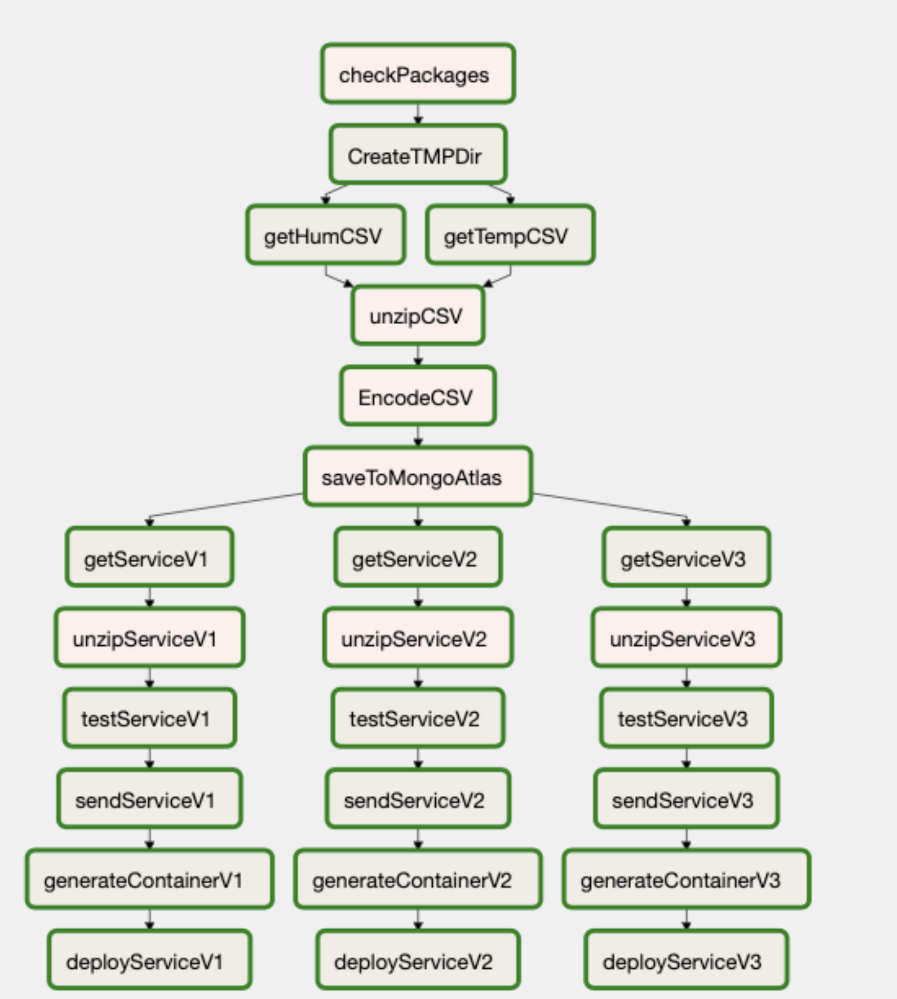

# Task orchestration with Apache Airflow

In this repository you can find a task orchestration exercise with Airflow. 
Specifically it implements a CI/CD cycle over the repositories

- https://github.com/pepitoenpeligro/cc2_weatherpredictor_v1
- https://github.com/pepitoenpeligro/cc2_weatherpredictor_v2
- https://github.com/pepitoenpeligro/cc2_weatherpredictor_v3

### Task Graph implemented

